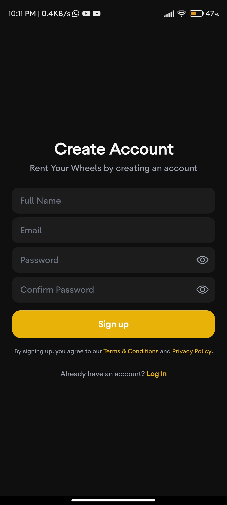
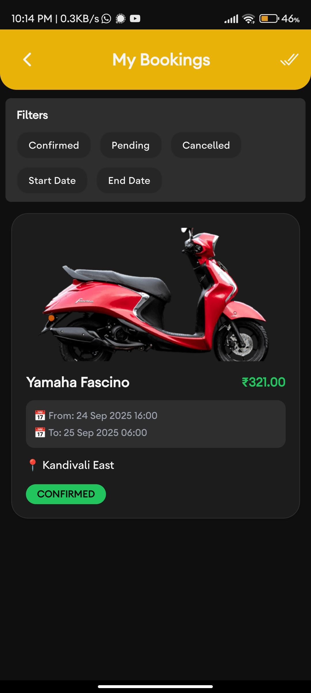

# 🛵 Wheel - Bike Rental App

**Wheel** is a modern bike rental app designed for **seamless urban mobility**. Built with a **full-stack TypeScript** setup, it provides a fast, intuitive, and reliable experience for renting bikes on the go.

---

## 🧰 Technology Stack

### Frontend

- **React Native CLI v0.79.0**
- **TypeScript**
- **NativeWind (Tailwind CSS)**
- **Zod** (for validation)
- **React Hook Form** (form handling)
- **Axios** (API requests)
- **MMKV** (local storage & state persistence)

### Backend

- **Node.js**
- **Express.js**
- **PostgreSQL** (Database)
- **Prisma** (ORM)
- **Docker** (Development & deployment)
- **Zod** (input validation)
- **Bun** (package manager)

---

## 📱 Screenshots

### **1. Splash, Login & Signup**

| Splash                                               | Login                                               | Signup                                               |
| ---------------------------------------------------- | --------------------------------------------------- | ---------------------------------------------------- |
|  |  |  |

---

### **2. Home & Navigation**

| Home 1                                               | Home 2                                               | Menu                                               | Logout                                         |
| ---------------------------------------------------- | ---------------------------------------------------- | -------------------------------------------------- | ---------------------------------------------- |
|  |  |  |  |

---

### **3. Search & Vehicle Selection**

| Search                                               | Vehicle Overlay 1                                                | Vehicle Overlay 2                                                |
| ---------------------------------------------------- | ---------------------------------------------------------------- | ---------------------------------------------------------------- |
|  |  |  |

---

### **4. Location & Booking**

| Location                                               | Pickup Date                                        | Pickup Time                                        | Booking Form                                                           |
| ------------------------------------------------------ | -------------------------------------------------- | -------------------------------------------------- | ---------------------------------------------------------------------- |
|  |  |  |  |

---

### **5. My Bookings & Summary**

| My Bookings                                              | Booking Summary 1                                              | Booking Summary 2                                              |
| -------------------------------------------------------- | -------------------------------------------------------------- | -------------------------------------------------------------- |
|  |  |  |

---

### **6. Subscriptions**

| Subscriptions                                              |
| ---------------------------------------------------------- |
|  |

---

## 🚀 Installation & Running

### Frontend

```bash
git clone `https://github.com/adityaj07/wheel.git`
cd wheel
bun install # install dependencies
bun run android # or run-ios
```

### Backend

```bash
git clone <repo-url>
cd backend
bun install # install dependencies
bun run setup:local # sets up docker, pushes local db schema, generates prisma client
bun run dev # start backend in hot-reload mode using .env.local
```

### Docker Commands (Optional)

```bash
bun run docker:up        # start all services
bun run docker:up:db     # start only PostgreSQL
bun run docker:down      # stop services
bun run docker:logs      # view logs
bun run docker:clean     # stop and remove containers and volumes
```

### Database Commands

```bash
bun run db:push:local     # push local schema to DB
bun run db:migrate:local  # run migrations locally
bun run db:studio:local    # open Prisma Studio locally
bun run db:seed:local      # seed local DB
```

---

## Download Release APK

You can download the latest release here:  
[Wheel v1.0.0 Release APK](https://github.com/adityaj07/wheel/releases/download/v1.0.0/wheel-release-v1.0.0.apk)

> On Android, enable "Install unknown apps" if prompted.
